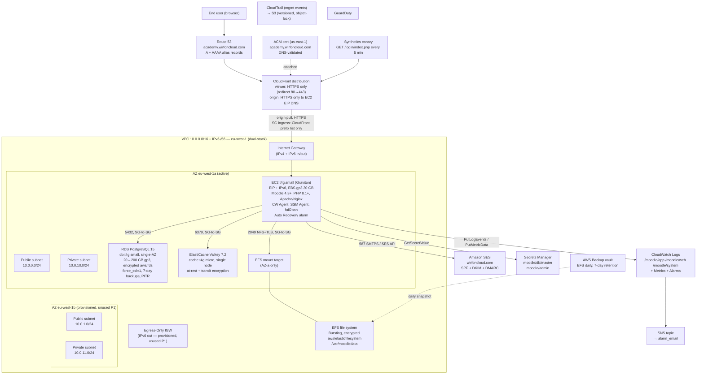

# Phase 1 Design Document — Moodle LMS on AWS

**Project:** Moodle Learning Management System
**Domain:** academy.wirfoncloud.com
**Region (workload):** eu-west-1 (Ireland)
**Region (CloudFront ACM cert only):** us-east-1 (N. Virginia)
**Document Status:** Draft for review — supersedes nothing; first design doc for the project
**Source-of-truth requirements:** [`.specs/phase-1/requirements.md`](./requirements.md) — approved, immutable

This document translates the approved Phase 1 requirements into a concrete Terraform design. It does **not** introduce capability beyond requirements.md, nor does it relitigate the architectural hard rules in [`CLAUDE.md`](../../CLAUDE.md). Where a requirement allows multiple shapes, this document picks one and explains why.

No Terraform code is written until both this design and `tasks.md` are approved.

---

## 1. Architecture diagram

The diagram below is the canonical Phase 1 topology. Greyed nodes are *provisioned* (so Phase 3 HA is a non-refactoring addition) but *unused* in Phase 1.



**Legend (one line per service):**

| Component | Role in Phase 1 |
|---|---|
| Route 53 | Authoritative DNS for `wirfoncloud.com`; A + AAAA alias to CloudFront |
| ACM (us-east-1) | Public TLS cert attached to CloudFront viewer; DNS-validated against Route 53 |
| CloudFront | TLS termination, HTTP→HTTPS redirect, static caching, future WAF attachment point |
| VPC + IGW + EIGW | Dual-stack network; EIGW is dormant (Phase 3 enabler) |
| Public subnets | Phase 1 EC2 home (no NAT means we live here); 2 AZs provisioned, 1 used |
| Private subnets | Stateful tier (RDS / ElastiCache / EFS MT); 2 AZs provisioned, 1 used |
| EC2 (t4g.small) | Single Moodle host; admin via SSM Session Manager only |
| RDS PostgreSQL | Single-AZ, encrypted, force-SSL, 7-day automated backups + PITR |
| ElastiCache Valkey | Sessions + Moodle Universal Cache |
| EFS | `/var/moodledata` shared file storage (one MT in AZ-a) |
| AWS Backup | EFS daily snapshot vault, 7-day retention |
| Secrets Manager | DB master password and Moodle admin password (manual rotation) |
| SES | Outbound transactional email |
| CloudWatch Logs/Metrics/Alarms/SNS | Observability and alerting (single email subscription) |
| Synthetics canary | External "are we up?" probe every 5 min |
| CloudTrail + S3 | Account-level audit trail, object-locked bucket |
| GuardDuty | Threat detection across the account |

---

## 2. Terraform module decomposition (8 modules)

Module names are fixed by `CLAUDE.md`. No top-level modules will be invented. The schema below is the public contract each module must satisfy.

### 2.1 `modules/network`

- **Purpose:** the VPC, its subnets/gateways/routes, VPC Flow Logs, and the IAM role the Flow Logs service uses to write to CloudWatch Logs. Hosting the role here (rather than in `security`) avoids a `network ↔ security` module-level cycle: previously `network` needed the role ARN from `security`, while `security` needed `vpc_id` from `network`.
- **Key resources:**
  - `aws_vpc` (CIDR 10.0.0.0/16, IPv6 Amazon-provided /56, DNS hostnames + DNS support enabled)
  - `aws_subnet` × 4 (2 public, 2 private; IPv6 /64 each; `map_public_ip_on_launch = true` only on public subnets)
  - `aws_internet_gateway`
  - `aws_egress_only_internet_gateway` (provisioned for Phase 3; not associated with any route in Phase 1)
  - `aws_route_table` × 2 (public → IGW for `0.0.0.0/0` and `::/0`; private → empty in P1, plus IPv6 `::/0` → EIGW for forward-compat)
  - `aws_route_table_association` × 4
  - `aws_default_route_table` overridden to be empty (defensive)
  - `aws_iam_role` `vpc_flow_logs_role` (trust: `vpc-flow-logs.amazonaws.com`) + `aws_iam_role_policy` granting `logs:CreateLogStream`/`PutLogEvents`/`DescribeLogGroups`/`DescribeLogStreams` scoped to the flow-logs log-group ARN only
  - `aws_cloudwatch_log_group` for flow logs (14-day retention, encrypted with `aws/logs`)
  - `aws_flow_log` (VPC-level, all traffic, → CloudWatch Logs, `iam_role_arn` = the role above)
- **Inputs:** `project_name`, `environment`, `vpc_cidr`, `availability_zones[]`, `public_subnet_cidrs[]`, `private_subnet_cidrs[]`, `vpc_flow_log_retention_days`.
- **Outputs:** `vpc_id`, `vpc_cidr_block`, `public_subnet_ids[]`, `private_subnet_ids[]`, `igw_id`, `eigw_id`, `vpc_flow_logs_role_arn` (exposed for completeness; no other module consumes it).
- **Depends on:** nothing internal.

### 2.2 `modules/security`

- **Purpose:** Security Groups, IAM roles for runtime principals (EC2 instance, AWS Backup), and Secrets Manager secrets. The VPC Flow Logs role now lives in `modules/network` (see §2.1) to remove the previous `network ↔ security` cycle. The GitHub OIDC provider and the *deploy* IAM role live in `terraform/bootstrap/`, **not** here.
- **Key resources:**
  - `aws_security_group` × 4 (`web_sg`, `db_sg`, `cache_sg`, `efs_sg`) — each created with `lifecycle.create_before_destroy = true` and **no inline rules**
  - `aws_security_group_rule` (or `aws_vpc_security_group_*_rule`) × N — separate resources to break the SG-to-SG dependency cycle
  - `aws_iam_role` `moodle_ec2_role` + `aws_iam_instance_profile`
  - `aws_iam_role_policy_attachment` × 2 (`AmazonSSMManagedInstanceCore`, `CloudWatchAgentServerPolicy`)
  - `aws_iam_role_policy` × 3 (Secrets Manager read, SES send, KMS decrypt)
  - `aws_iam_role` `aws_backup_role` + managed-policy attachments (`AWSBackupServiceRolePolicyForBackup`, `…ForRestores`)
  - `random_password` × 2 (DB master, Moodle admin)
  - `aws_secretsmanager_secret` × 2 (`moodle/db/master`, `moodle/admin`) — encrypted with `aws/secretsmanager`
  - `aws_secretsmanager_secret_version` × 2
- **Inputs:** `project_name`, `environment`, `vpc_id`, `cloudfront_prefix_list_id` (data source).
- **Outputs:** `web_sg_id`, `db_sg_id`, `cache_sg_id`, `efs_sg_id`, `ec2_instance_profile_name`, `db_secret_arn`, `admin_secret_arn`, `backup_role_arn`.
- **Depends on:** `network` (needs `vpc_id`).

### 2.3 `modules/compute`

- **Purpose:** the single EC2 instance and its EIP.
- **Key resources:**
  - `data "aws_ami" "ubuntu"` filtering on Canonical (`owners = ["099720109477"]`), name pattern `"ubuntu/images/hvm-ssd*/ubuntu-jammy-22.04-arm64-server-*"`, `most_recent = true` — stock Ubuntu 22.04 LTS arm64 to match the `t4g.small` Graviton instance.
  - `aws_instance` (`t4g.small`, AMI from the data source above; root EBS gp3 30 GB encrypted with `aws/ebs`; **IMDSv2 required** via `metadata_options.http_tokens = "required"`; **user-data installs Moodle 4.3+, PHP 8.1+, Apache, CloudWatch Agent, fail2ban, and unattended-upgrades on first boot**, then renders Moodle `config.php` from Secrets Manager values. Packer is deferred to Phase 3 — Phase 1 accepts the ~10-minute first-boot in exchange for one fewer build pipeline.)
  - `aws_eip` + `aws_eip_association`
  - `aws_cloudwatch_metric_alarm` `StatusCheckFailed_System` with `recover` action (EC2 Auto Recovery — no replacement, just an in-place recover)
- **Inputs:** `project_name`, `environment`, `instance_type`, `root_volume_gb`, `public_subnet_id` (AZ-a only), `web_sg_id`, `ec2_instance_profile_name`, `domain_name`, `db_endpoint`, `db_port`, `db_secret_arn`, `cache_endpoint`, `cache_port`, `efs_id`, `admin_secret_arn`, `moodle_admin_email`, `aws_region`.
- **Outputs:** `instance_id`, `instance_arn`, `eip_public_ip`, `eip_public_dns`.
- **Depends on:** `network`, `security`, `data`, `cache`, `storage` (user-data needs all the endpoints and secret ARNs).

#### Moodle wwwroot consistency
Three settings must align to prevent Moodle generating links that point at the EC2 origin hostname instead of the CloudFront FQDN:
1. `config.php` sets `$CFG->wwwroot = "https://academy.wirfoncloud.com"` at install time (rendered from `var.domain_name` in the user-data template).
2. Apache VirtualHost includes `ServerName academy.wirfoncloud.com` and `UseCanonicalName On`.
3. CloudFront's origin request policy forwards the `Host` header — see §2.7.

### 2.4 `modules/data`

- **Purpose:** RDS PostgreSQL.
- **Key resources:**
  - `aws_db_subnet_group` (both private subnets — required by RDS even in single-AZ)
  - `aws_db_parameter_group` (custom, sets `rds.force_ssl = 1` and `log_statement = ddl`)
  - `aws_db_instance` (`db.t4g.small`, engine `postgres` 15.x, `multi_az = false`, `storage_type = gp3`, `allocated_storage = 20`, `max_allocated_storage = 200`, `storage_encrypted = true` with `aws/rds`, `backup_retention_period = 7`, `backup_window = "01:00-02:00"`, `maintenance_window = "sun:02:30-sun:03:30"`, `deletion_protection = true`, `performance_insights_enabled = true` (free 7-day retention), `auto_minor_version_upgrade = true`, master password from Secrets Manager via `manage_master_user_password = false` and `password = random_password.…` — **rotation is manual in P1**)
  - `lifecycle.prevent_destroy = true`
- **Inputs:** `project_name`, `environment`, `db_subnet_ids[]`, `db_sg_id`, `db_instance_class`, `db_allocated_storage_gb`, `db_max_allocated_storage_gb`, `db_engine_version`, `db_backup_retention_days`, `db_master_username`, `db_master_password` (from `security`).
- **Outputs:** `db_endpoint`, `db_port`, `db_id`, `db_arn`, `db_resource_id` (for IAM auth in P3).
- **Depends on:** `network`, `security`.

### 2.5 `modules/cache`

- **Purpose:** ElastiCache Valkey.
- **Key resources:**
  - `aws_elasticache_subnet_group` (both private subnets)
  - `aws_elasticache_parameter_group` (family appropriate to engine version)
  - `aws_elasticache_replication_group` with `engine = "valkey"`, `num_node_groups = 1`, `replicas_per_node_group = 0`, `automatic_failover_enabled = false`, `at_rest_encryption_enabled = true`, `transit_encryption_enabled = true`, `transit_encryption_mode = "required"`, `multi_az_enabled = false`
- **Inputs:** `project_name`, `environment`, `cache_node_type`, `cache_engine_version`, `cache_subnet_ids[]`, `cache_sg_id`.
- **Outputs:** `cache_endpoint` (primary endpoint), `cache_port`, `cache_cluster_id`.
- **Depends on:** `network`, `security`.

### 2.6 `modules/storage`

- **Purpose:** EFS file system + AWS Backup.
- **Key resources:**
  - `aws_efs_file_system` (Bursting throughput, encrypted with `aws/elasticfilesystem`, `lifecycle_policy { transition_to_ia = "AFTER_30_DAYS" }` for cost, `prevent_destroy = true`)
  - `aws_efs_mount_target` × 1 (AZ-a private subnet only — explicit single-AZ choice)
  - `aws_efs_file_system_policy` enforcing `aws:SecureTransport = true`
  - `aws_backup_vault` (uses `aws/backup` AWS-managed key; **no vault-level CMK**)
  - `aws_backup_plan` (one rule: daily at 02:00 UTC, 7-day retention)
  - `aws_backup_selection` selecting EFS by tag `BackupPolicy = "daily-7d"`
- **Inputs:** `project_name`, `environment`, `efs_subnet_id` (AZ-a private), `efs_sg_id`, `efs_throughput_mode`, `efs_backup_retention_days`, `backup_role_arn`.
- **Outputs:** `efs_id`, `efs_arn`, `efs_dns_name`.
- **Depends on:** `network`, `security`.

### 2.7 `modules/dns_cdn`

- **Purpose:** Route 53 records, CloudFront distribution, and SES domain identity (DKIM/SPF/DMARC). The hosted zone for `wirfoncloud.com` is **assumed to exist** and is read via a data source; it is not a variable. The operator verifies the zone manually before `terraform apply` (§8 step 2).
- **Key resources:**
  - `data "aws_route53_zone" "main" { name = "wirfoncloud.com." }` — hardcoded zone name (trailing dot is intentional; reduces lookup ambiguity)
  - `data "aws_acm_certificate"` in the `us_east_1` aliased provider (cert created in bootstrap, looked up by domain)
  - `aws_cloudfront_distribution`
    - **Origin:** custom origin pointing at the EC2 EIP DNS name (e.g. `ec2-…compute.amazonaws.com`), `origin_protocol_policy = "https-only"`, `origin_ssl_protocols = ["TLSv1.2"]`
    - **Default cache behavior:** GET/HEAD/OPTIONS, `viewer_protocol_policy = "redirect-to-https"`, AWS-managed cache policy `Managed-CachingDisabled` (Moodle is mostly dynamic), AWS-managed origin request policy `Managed-AllViewer` so Moodle sees real headers/cookies
    - **AJAX cache behavior** for `/lib/ajax/*` (highest precedence): all HTTP methods allowed (`GET`/`HEAD`/`OPTIONS`/`PUT`/`POST`/`PATCH`/`DELETE`), AWS-managed `Managed-CachingDisabled`. Moodle's AJAX RPC endpoint (`/lib/ajax/service.php`) is POST-heavy and per-user; must be passed to the origin uncached. **Must precede the `/lib/*` behavior** below so CloudFront matches the AJAX path first. Added after post-mortem 2026-05-11.
    - **Static-asset cache behavior** for `/theme/*`, `/pluginfile.php/*`, `/lib/*`, `*.css`, `*.js` paths: `GET`/`HEAD`/`OPTIONS` only, AWS-managed `Managed-CachingOptimized` policy (this is the Rwanda-latency mitigation called out in requirements §4.2)
    - **Viewer cert:** ACM ARN from us-east-1 lookup, `minimum_protocol_version = "TLSv1.2_2021"`, `ssl_support_method = "sni-only"`
    - **Aliases:** `[var.domain_name]`
    - **Logging:** omitted in Phase 1 to keep cost down
  - `aws_route53_record` × 2 (A and AAAA, both alias records to the CloudFront domain name)
  - `aws_ses_domain_identity` for `wirfoncloud.com`
  - `aws_ses_domain_dkim` (generates the three CNAME tokens AWS expects)
  - `aws_route53_record` × 3 — DKIM CNAMEs (`<token>._domainkey.wirfoncloud.com → <token>.dkim.amazonses.com`)
  - `aws_route53_record` — SPF TXT (`"v=spf1 include:amazonses.com -all"`)
  - `aws_route53_record` — DMARC TXT (`"v=DMARC1; p=quarantine; rua=mailto:${var.dmarc_rua_address}"`) on `_dmarc.wirfoncloud.com`
  - `aws_ses_domain_identity_verification` — waits for SES to confirm the TXT record before signalling apply success
  - **SES sandbox note:** Phase 1 assumes the account is in the SES sandbox in eu-west-1. Domain identity + DKIM are still provisioned by Terraform so DNS is correct; production access is a one-time AWS support request handled out-of-band per `docs/runbooks/ses.md`. Pilot recipient addresses are verified manually in the console while in sandbox.
- **Inputs:** `project_name`, `environment`, `domain_name`, `dmarc_rua_address`, `origin_domain_name` (from `compute.eip_public_dns`), `acm_certificate_arn` (data-source lookup in us-east-1).
- **Outputs:** `cloudfront_distribution_id`, `cloudfront_distribution_arn`, `cloudfront_domain_name`, `ses_domain_identity_arn`.
- **Depends on:** `compute` (origin), `bootstrap` (cert exists already).

#### Moodle wwwroot consistency — Host header forwarding
The default cache behavior uses the AWS-managed `Managed-AllViewer` origin request policy, **not** `Managed-AllViewerExceptHostHeader`. `Managed-AllViewer` forwards the `Host` header to the EC2 origin; Apache's `UseCanonicalName On` directive needs it to build correct absolute URLs. Using `AllViewerExceptHostHeader` strips `Host`, causing Apache to fall back to the EC2 private hostname — producing broken Moodle links even with `$CFG->wwwroot` correctly set.

### 2.8 `modules/observability`

- **Purpose:** logs, metrics, alarms, SNS, canary, GuardDuty. (CloudTrail lives in `terraform/bootstrap/` — see §6.1 — because it is an account-level, lifecycle-stable concern, not a per-environment one.)
- **Key resources:**
  - `aws_cloudwatch_log_group` × 4: `/moodle/app`, `/moodle/web`, `/moodle/system` (30-day retention) and `/aws/canary/moodle` (30-day) — all encrypted with `aws/logs`
  - `aws_ssm_parameter` `/moodle/cloudwatch-agent/config` (CW Agent JSON config; consumed by user-data)
  - `aws_sns_topic` `moodle-alarms`
  - `aws_sns_topic_subscription` (protocol email, endpoint = `var.alarm_email`)
  - `aws_cloudwatch_metric_alarm` × 10 — see §4 below for the full alarm list
  - `aws_synthetics_canary` (Node.js runtime, schedule rate 5 min, hits `https://${var.domain_name}/login/index.php`, expects HTTP 200)
  - `aws_iam_role` `synthetics_canary_role` + inline policy
  - `aws_s3_bucket` for canary artifacts (versioning, public-access-block, encryption, 30-day lifecycle expiration)
  - **GuardDuty (account-wide):** `data "aws_regions" "all"` filtered to `opt_in_status = "opted-in" or "opt-in-not-required"`; `aws_guardduty_detector` created via `for_each` over those regions using one provider alias per region declared in `versions.tf`. Each detector uses the regional default settings; central admin/delegation is deferred to multi-account work in Phase 2.
- **Inputs:** `project_name`, `environment`, `alarm_email`, `log_retention_days`, `instance_id`, `db_id`, `cache_cluster_id`, `efs_id`, `domain_name`, `cloudfront_distribution_id`, `enable_synthetics_canary`, `enable_guardduty`.
- **Outputs:** `sns_topic_arn`, `app_log_group_name`, `web_log_group_name`, `system_log_group_name`.
- **Depends on:** `compute`, `data`, `cache`, `storage`, `dns_cdn`.

### 2.9 Module dependency order

```
network → security → { data, cache, storage } → compute → dns_cdn → observability
```

This is now a true linear order — no cycles. The previous `network ↔ security` cycle was removed by hosting the VPC Flow Logs IAM role inside `modules/network` itself (§2.1). At the root level, this is the apply order Terraform's graph will produce automatically from the inter-module references.

---

## 3. Variable contract (single table)

This is the workload root variable surface (`terraform/environments/pilot/variables.tf`). Bootstrap variables are listed in §6 separately. All variable names are `snake_case`. Defaults are chosen so a `terraform apply` with only the three required variables (`alarm_email`, `moodle_admin_email`, optionally `github_repo` if it differs from the default) set would succeed in the target account. The Ubuntu AMI is resolved via a `data "aws_ami"` source inside `modules/compute` and is **not** a variable. The Route 53 hosted zone (`wirfoncloud.com.`) is resolved via a `data "aws_route53_zone"` source inside `modules/dns_cdn` and is **not** a variable.

| # | Name | Type | Default | Purpose |
|---|---|---|---|---|
| **Identity & tags** | | | | |
| 1 | `project_name` | `string` | `"moodle-academy"` | Resource-name prefix and `Project` tag value |
| 2 | `environment` | `string` | `"pilot"` | Logical environment name; `Environment` tag value |
| 3 | `cost_center` | `string` | `"pilot"` | `CostCenter` tag value |
| 4 | `aws_region` | `string` | `"eu-west-1"` | Workload region |
| 5 | `github_repo` | `string` | `"banjika/wirfo-moodle-aws"` | `<owner>/<repo>` — used by bootstrap for OIDC trust scoping. Surfaced in the workload table for traceability; the bootstrap config reads the same value. |
| **Network** | | | | |
| 6 | `vpc_cidr` | `string` | `"10.0.0.0/16"` | Primary IPv4 CIDR |
| 7 | `availability_zones` | `list(string)` | `["eu-west-1a", "eu-west-1b"]` | The two AZs provisioned at the VPC layer |
| 8 | `active_availability_zone` | `string` | `"eu-west-1a"` | Single AZ where Phase 1 actually runs workloads. **Changing this post-deployment requires migrating every stateful resource (RDS, ElastiCache, EFS mount target) — not a hot-swap.** |
| 9 | `public_subnet_cidrs` | `list(string)` | `["10.0.0.0/24", "10.0.1.0/24"]` | One per AZ; index 0 = active AZ |
| 10 | `private_subnet_cidrs` | `list(string)` | `["10.0.10.0/24", "10.0.11.0/24"]` | One per AZ; index 0 = active AZ |
| 11 | `vpc_flow_log_retention_days` | `number` | `14` | Flow logs CW retention |
| **DNS** | | | | |
| 12 | `domain_name` | `string` | `"academy.wirfoncloud.com"` | Public-facing FQDN |
| 13 | `dmarc_rua_address` | `string` | `"dmarc@wirfoncloud.com"` | RUA mailbox in the DMARC TXT record published by `modules/dns_cdn` |
| **Compute** | | | | |
| 14 | `instance_type` | `string` | `"t4g.small"` | Graviton (hard-rule §6 cost target) |
| 15 | `root_volume_gb` | `number` | `30` | EBS gp3 root volume size |
| **Data (RDS)** | | | | |
| 16 | `db_instance_class` | `string` | `"db.t4g.small"` | |
| 17 | `db_allocated_storage_gb` | `number` | `20` | Initial gp3 allocation |
| 18 | `db_max_allocated_storage_gb` | `number` | `200` | Storage autoscaling ceiling |
| 19 | `db_engine_version` | `string` | `"15.7"` | Pinned minor; review on PG 16 GA in eu-west-1 |
| 20 | `db_backup_retention_days` | `number` | `7` | RPO is 24 h; 7-day window covers PITR + headroom |
| 21 | `db_master_username` | `string` | `"moodle_admin"` | RDS master username |
| **Cache** | | | | |
| 22 | `cache_node_type` | `string` | `"cache.t4g.micro"` | |
| 23 | `cache_engine_version` | `string` | `"7.2"` | Valkey 7.2 — cheapest current option vs. Redis OSS |
| **Storage (EFS)** | | | | |
| 24 | `efs_throughput_mode` | `string` | `"bursting"` | Cheaper than `elastic` at this scale |
| 25 | `efs_backup_retention_days` | `number` | `7` | AWS Backup vault retention |
| **Application** | | | | |
| 26 | `moodle_admin_email` | `string` | *(no default)* | Required. Initial Moodle admin email used at install time. Must match a verified SES recipient while the account is in the SES sandbox (see §6.1, runbooks/ses.md). |
| **Observability** | | | | |
| 27 | `alarm_email` | `string` | *(no default)* | Required. Single email subscription to the SNS alarm topic. PagerDuty/OpsGenie deferred to Phase 2. |
| 28 | `log_retention_days` | `number` | `30` | Per requirements §4 |
| 29 | `enable_synthetics_canary` | `bool` | `true` | Toggle the 5-min health probe |
| 30 | `enable_guardduty` | `bool` | `true` | When `true`, enables GuardDuty in eu-west-1 *and* every other region the account has opted into |
| **Phase 3 toggles (all default `false` in Phase 1)** | | | | |
| 31 | `enable_high_availability` | `bool` | `false` | Master HA flag |
| 32 | `rds_multi_az` | `bool` | `false` | Independent RDS HA flag |
| 33 | `enable_alb` | `bool` | `false` | Independent ALB flag |
| 34 | `cache_cluster_mode` | `bool` | `false` | Independent ElastiCache replica/cluster flag |
| **Tagging** | | | | |
| 35 | `extra_tags` | `map(string)` | `{}` | Caller-supplied tags merged on top of `default_tags` |

The four mandatory tags from `CLAUDE.md` (`Project`, `Environment`, `ManagedBy`, `CostCenter`) are applied via `default_tags` on the AWS provider, *not* per-resource — so they cannot be forgotten.

---

## 4. Security Group matrix

All ingress is SG-to-SG (hard rule #8) or AWS-managed prefix list (hard rule #7). No `0.0.0.0/0` ingress exists anywhere. No port 22 is opened anywhere (hard rule #6).

| SG | Direction | Protocol/Port | Source / Destination | Justification |
|---|---|---|---|---|
| `web_sg` | ingress | TCP 443 | `pl-…cloudfront-origin-facing` (managed prefix list) | Hard rule #7 — CloudFront-only origin reach |
| `web_sg` | ingress | TCP 80 | `pl-…cloudfront-origin-facing` | Origin-side redirect target; CloudFront still needs port 80 if origin emits one |
| `web_sg` | egress | TCP 443 | `0.0.0.0/0`, `::/0` | AWS API endpoints (SSM, Secrets Manager, CW, SES API), Ubuntu repos, GuardDuty agent — no NAT means we egress directly |
| `web_sg` | egress | TCP 587 | `0.0.0.0/0`, `::/0` | SES SMTP submission |
| `web_sg` | egress | TCP 5432 | `db_sg` | PostgreSQL |
| `web_sg` | egress | TCP 6379 | `cache_sg` | Valkey |
| `web_sg` | egress | TCP 2049 | `efs_sg` | NFS over TLS |
| `db_sg` | ingress | TCP 5432 | `web_sg` | App → DB |
| `db_sg` | egress | — | (none) | Default deny — RDS does not need outbound |
| `cache_sg` | ingress | TCP 6379 | `web_sg` | App → cache |
| `cache_sg` | egress | — | (none) | Default deny |
| `efs_sg` | ingress | TCP 2049 | `web_sg` | App → EFS |
| `efs_sg` | egress | — | (none) | Default deny |

**Notes:**

1. **Why outbound HTTPS is `0.0.0.0/0`, not a prefix list.** AWS-managed prefix lists exist for a few services (S3, DynamoDB) but not the broad set the EC2 instance must reach (SSM endpoints in eu-west-1, SES API endpoints, package repos, CloudWatch Agent endpoints). VPC Interface Endpoints would let us tighten this but require ENIs in private subnets and ENI-hour cost — explicitly out of scope per requirements §6.
2. **No SG for VPC endpoints.** Phase 1 does not provision any Interface Endpoints (cost stance).
3. **No SG for an ALB.** None exists in Phase 1 (hard rule #4).
4. **Why port 80 on `web_sg` ingress.** Even though the viewer-side redirects HTTP→HTTPS at CloudFront, some Moodle features (e.g., wwwroot probing) and operational debugging are simpler when the origin briefly serves a 301. Removing port 80 from web_sg is a safe one-line tightening if requirements §3 FR-1 is interpreted strictly.
5. **How "(none)" egress is enforced.** AWS creates new security groups with a default *allow-all* egress rule. To make the matrix's "(none)" entries true in Terraform, all four `aws_security_group` resources set `egress = []` explicitly inside the resource block (this overrides the default). Egress that *is* required — `web_sg`'s outbound rules — is added via separate `aws_vpc_security_group_egress_rule` resources, consistent with the SG-to-SG cycle-breaking pattern in §2.2.

---

## 5. IAM policy matrix

Every role is least-privilege. No `*:*`. No long-lived access keys (hard rule, requirements §7.1).

| Principal | Trust | Managed policies | Inline policy summary |
|---|---|---|---|
| **`moodle_ec2_role`** (workload, attached via instance profile) | `ec2.amazonaws.com` | `AmazonSSMManagedInstanceCore`, `CloudWatchAgentServerPolicy` | (1) `secretsmanager:GetSecretValue` on `arn:aws:secretsmanager:eu-west-1:<acct>:secret:moodle/*`. (2) `ses:SendEmail`/`ses:SendRawEmail` on `*` with condition `ses:FromAddress` like `*@wirfoncloud.com`. (3) `kms:Decrypt`/`kms:GenerateDataKey` on the AWS-managed keys for SecretsManager and RDS (resource: `*`, condition `kms:ViaService` scoped to those services). (4) `cloudwatch:PutMetricData` on namespace `Moodle/*`. |
| **`vpc_flow_logs_role`** | `vpc-flow-logs.amazonaws.com` | — | `logs:CreateLogStream`, `logs:PutLogEvents`, `logs:DescribeLogGroups`, `logs:DescribeLogStreams` scoped to the flow-logs log-group ARN only |
| **`aws_backup_role`** | `backup.amazonaws.com` | `AWSBackupServiceRolePolicyForBackup`, `AWSBackupServiceRolePolicyForRestores` | — |
| **`synthetics_canary_role`** | `lambda.amazonaws.com` (Synthetics is Lambda-backed) | — | `s3:PutObject` on canary-artifacts bucket, `logs:CreateLogStream`/`PutLogEvents` on `/aws/canary/*`, `cloudwatch:PutMetricData` on namespace `CloudWatchSynthetics`, `xray:PutTraceSegments` (free tier) |
| **GitHub Actions OIDC deploy role** *(lives in `terraform/bootstrap/`)* | Federated to `arn:aws:iam::<acct>:oidc-provider/token.actions.githubusercontent.com` with conditions `aud = sts.amazonaws.com` and `sub = repo:banjika/wirfo-moodle-aws:*` (**any branch** — Phase 1 simplification; Phase 2 will tighten to `:ref:refs/heads/main` plus `:pull_request` once the apply path stabilises) | — | Service-scoped CRUD: `ec2:*`, `vpc:*`, `rds:*`, `elasticache:*`, `elasticfilesystem:*`, `cloudfront:*`, `route53:Change*`/`Get*`/`List*` on the hosted zone only, `acm:*` (us-east-1 too — needs region-agnostic statement), `ses:*` on the `wirfoncloud.com` identity only, `cloudwatch:*`, `logs:*`, `sns:*`, `backup:*`, `guardduty:*`, `cloudtrail:*`, `secretsmanager:*` on `arn:…:secret:moodle/*`, **SSM Parameter Store**: `ssm:PutParameter`, `ssm:GetParameter`, `ssm:DeleteParameter`, `ssm:GetParameterHistory`, `ssm:DescribeParameters`, `ssm:AddTagsToResource`, `ssm:RemoveTagsFromResource`, `ssm:ListTagsForResource` on `arn:aws:ssm:eu-west-1:<account-id>:parameter/moodle/*` (needed for the `aws_ssm_parameter "/moodle/cloudwatch-agent/config"` in `modules/observability`), `iam:*` scoped to roles tagged `Project = moodle-academy` plus `iam:PassRole` to `moodle_ec2_role`, `s3:*` on the state bucket and CloudTrail bucket only, `dynamodb:*` on the lock table only, `kms:Decrypt`/`Describe*` on AWS-managed keys, `sts:GetCallerIdentity`. **No `*:*` statement.** |
| **`rds_enhanced_monitoring_role`** *(only created if `db_monitoring_interval > 0`)* | `monitoring.rds.amazonaws.com` | `AmazonRDSEnhancedMonitoringRole` | — |

**Notes:**

1. **OIDC trust is permissive in Phase 1.** The `sub` wildcard `repo:banjika/wirfo-moodle-aws:*` lets any branch in the repo assume the deploy role. The apply path is gated by **GitHub Environment approval** (§7.2), not by IAM — so a malicious branch can request a plan but cannot apply without operator approval. Phase 2 tightens the trust to `:ref:refs/heads/main` (apply) and `:pull_request` (plan) once the apply pipeline is stable.
2. The deploy role does **not** have `iam:CreateOpenIDConnectProvider` because the OIDC provider is a bootstrap resource that already exists when the deploy role is used.
3. The instance role intentionally does not have `secretsmanager:RotateSecret` — Phase 1 rotation is manual (requirements §2.1).
4. **`ses:*` on the deploy role is a Phase 1 simplification.** Phase 2 should tighten the deploy role's SES grant on the `wirfoncloud.com` identity to the specific actions Terraform actually invokes: `ses:VerifyDomainIdentity`, `ses:GetIdentityVerificationAttributes`, `ses:PutIdentityPolicy`, `ses:SetIdentityDkimEnabled`, `ses:SetIdentityFeedbackForwardingEnabled`, `ses:SetIdentityNotificationTopic`. The wildcard is acceptable in Phase 1 only because (a) the resource is already scoped to one identity and (b) the alternative — enumerating actions before the workload's SES surface stabilises — is churn for no security gain at pilot scale.

---

## 6. State backend design

Two configurations, two state files, deliberate split.

### 6.1 Bootstrap configuration (`terraform/bootstrap/`)

- **State:** local (`terraform.tfstate` + backup, *not* committed; bootstrap is run on a trusted operator workstation under SSO credentials).
- **Lock:** none (single operator, run manually, almost never re-run).
- **Resources created:**
  - `aws_s3_bucket` for workload state — name `wirfo-moodle-tfstate-<account-id>`, versioning, SSE-S3, public-access-block, `prevent_destroy = true`, ownership controls = `BucketOwnerEnforced`
  - `aws_s3_bucket_lifecycle_configuration` on the state bucket — keep noncurrent versions for 90 days
  - `aws_dynamodb_table` `wirfo-moodle-tflock` (PK `LockID` string, on-demand billing, point-in-time recovery)
  - `aws_iam_openid_connect_provider` for `token.actions.githubusercontent.com`
  - `aws_iam_role` GitHub Actions deploy role (see §5; trust scope `repo:banjika/wirfo-moodle-aws:*`)
  - `aws_acm_certificate` in `us-east-1` for `academy.wirfoncloud.com`, DNS validation
  - `data "aws_route53_zone" "main" { name = "wirfoncloud.com." }` — same hardcoded data source as `dns_cdn`
  - `aws_route53_record` × N — DNS validation CNAMEs in the existing hosted zone
  - `aws_acm_certificate_validation` to wait for issuance
  - **CloudTrail (account-level audit, lifecycled with bootstrap, not workload):**
    - `aws_s3_bucket` `wirfo-moodle-cloudtrail-<account-id>` — versioning enabled, public-access-block all-on, SSE with `aws/s3` (AWS-managed S3 key — **no CMK**), object lock enabled with COMPLIANCE mode and 90-day default retention, `prevent_destroy = true`, ownership controls `BucketOwnerEnforced`
    - `aws_s3_bucket_policy` granting `cloudtrail.amazonaws.com` `s3:GetBucketAcl` and `s3:PutObject` (with the `aws:SourceArn` condition restricting to this trail's ARN)
    - `aws_cloudtrail` `moodle-mgmt` — `is_multi_region_trail = true`, management events only (no data events in Phase 1; cost stance), `enable_log_file_validation = true`, `include_global_service_events = true`. KMS encryption at the trail level is NOT enabled; the bucket-level `aws/s3` SSE is the encryption boundary, consistent with the no-CMK rule.
- **Bootstrap variables** (separate from §3 because they are bootstrap-only):

| Name | Type | Default | Purpose |
|---|---|---|---|
| `aws_region` | `string` | `"eu-west-1"` | Bootstrap default region (for state bucket, lock table, CloudTrail home region) |
| `state_bucket_name` | `string` | *(no default)* | Computed `"wirfo-moodle-tfstate-${data.aws_caller_identity.current.account_id}"` recommended |
| `lock_table_name` | `string` | `"wirfo-moodle-tflock"` | DynamoDB lock table name |
| `cloudtrail_bucket_name` | `string` | *(no default)* | Computed `"wirfo-moodle-cloudtrail-${data.aws_caller_identity.current.account_id}"` recommended |
| `domain_name` | `string` | `"academy.wirfoncloud.com"` | Subject of the ACM cert |
| `github_repo` | `string` | `"banjika/wirfo-moodle-aws"` | OIDC trust subject scoping (`<owner>/<repo>`) |
| `acm_subject_alternative_names` | `list(string)` | `[]` | SANs (e.g., `www.academy.…`) — none in P1 |

- **Outputs:** `state_bucket_name`, `lock_table_name`, `cloudtrail_bucket_name`, `cloudtrail_arn`, `deploy_role_arn`, `acm_certificate_arn`. **These are operator-facing values, not consumed by the workload via `terraform_remote_state`.** Specifically: (a) the workload's `backend "s3"` block hardcodes the bucket and lock-table names because Terraform backend configuration cannot reference variables or remote state; (b) the workload reads the ACM cert via `data "aws_acm_certificate"` in the `us_east_1`-aliased provider, looking up by domain rather than by ARN; (c) `deploy_role_arn` is set by the operator as the GitHub repository variable `AWS_DEPLOY_ROLE_ARN` (§7); (d) the CloudTrail outputs are informational only.

### 6.2 Workload configuration (`terraform/environments/pilot/`)

- **`backend "s3"`** block:
  - `bucket = "wirfo-moodle-tfstate-<account-id>"`
  - `key = "pilot/terraform.tfstate"`
  - `region = "eu-west-1"`
  - `dynamodb_table = "wirfo-moodle-tflock"`
  - `encrypt = true`
- **Providers** (in `versions.tf`):
  - default: `region = var.aws_region` (eu-west-1)
  - aliased `us_east_1`: `region = "us-east-1"`, used **only** by the `dns_cdn` module's data lookup of the ACM cert
- **`default_tags`** on the default provider applies the four mandatory tags + `extra_tags`. The aliased provider repeats the same `default_tags` (Terraform does not inherit them across aliases).
- **`required_version = ">= 1.7"`**, **`hashicorp/aws ~> 5.0`** — pinned per `CLAUDE.md`.

### 6.3 Why split

Chicken-and-egg: Terraform cannot create the bucket it stores its own state in. The bootstrap config sidesteps this with local state. The split also keeps the workload's blast radius narrow — destroying the workload never touches the state bucket or the OIDC provider.

---

## 7. CI/CD pipeline outline

Two GitHub Actions workflows. Both authenticate via OIDC into the deploy role created in bootstrap. **Zero long-lived AWS credentials.**

### 7.1 `.github/workflows/terraform-plan.yml`

- **Trigger:** `pull_request` with `paths: ['terraform/**', '.github/workflows/terraform-*.yml']`.
- **Permissions:** `id-token: write`, `contents: read`, `pull-requests: write` (for plan-comment posting).
- **Job:** `plan`, `runs-on: ubuntu-22.04`.
- **Steps (in order, all blocking):**
  1. `actions/checkout@v4`
  2. `hashicorp/setup-terraform@v3` (version pinned)
  3. `aws-actions/configure-aws-credentials@v4` (OIDC, `role-to-assume = ${{ vars.AWS_DEPLOY_ROLE_ARN }}`, `aws-region = eu-west-1`, `audience = sts.amazonaws.com`)
  4. `terraform fmt -check -recursive`
  5. `terraform -chdir=terraform/environments/pilot init -backend-config=…`
  6. `terraform -chdir=terraform/environments/pilot validate`
  7. `terraform-linters/tflint --recursive` (tflint init via `.tflint.hcl`)
  8. `tfsec .`
  9. `bridgecrewio/checkov-action@…` (`-d . --quiet --soft-fail false`)
  10. `terraform -chdir=terraform/environments/pilot plan -out=tfplan -no-color`
  11. Post the plan output as a PR comment (concise, redacted)
- **Failure on any step:** red CI; cannot merge.

### 7.2 `.github/workflows/terraform-apply.yml`

- **Trigger:** `push` to `main` with `paths: ['terraform/**']`.
- **Permissions:** `id-token: write`, `contents: read`.
- **Environment:** `production` (a GitHub Environment with required reviewer = the operator). This is the human-approval gate.
- **Concurrency:** `group: terraform-apply-pilot`, `cancel-in-progress: false` — prevents two applies overlapping.
- **Steps:** identical to `plan` workflow up to step 10, then `terraform apply tfplan`.
- **First 2–3 applies are operator-driven locally** per `CLAUDE.md`. Only after the design has stabilised does the operator merge a PR that re-points apply to CI. This is documented in `docs/runbooks/first-deploy.md` (a future task, not in this design).

### 7.3 What lives outside the Terraform repo

Moodle plugin updates, code pushes, and DB schema migrations are **not** Terraform's job. A companion repository (out of scope here) uses a separate, smaller OIDC role with only `ssm:SendCommand` on instances tagged `Project = moodle-academy` to trigger upgrades via SSM RunCommand. Reference only — design.md does not specify this repo.

---

## 8. Bootstrap order

The full first-time deployment sequence. Steps 1–3 are manual prerequisites; step 4 is the first Terraform apply (bootstrap, including CloudTrail); step 6 is the first workload apply.

| # | Step | What | How long | Done by |
|---|---|---|---|---|
| 1 | **AWS account hygiene** | Root MFA, IAM Identity Center enabled, admin permission set assigned, Cost Anomaly Detection on, Free Tier alerts on, **AWS Budgets billing alarm at 120% of the $80/month target with SNS email subscription** (manual one-off — not in Terraform). | 30 min | Operator, manual |
| 2 | **Manually verify Route 53 hosted zone** | Run `aws route53 list-hosted-zones --query "HostedZones[?Name=='wirfoncloud.com.']"` and confirm exactly one zone is returned in this account. Run `dig NS wirfoncloud.com +short` against the registrar and confirm the four AWS NS records match the zone's `DelegationSet`. **This must be true before any `terraform apply`** — both bootstrap (ACM DNS validation + CloudTrail in same account) and the workload (`dns_cdn` data source) read this zone with no fallback. | 5 min | Operator, manual |
| 3 | **SES sandbox awareness** | Note that the account is in the SES sandbox in eu-west-1. The **workload apply (step 6)** will provision the SES domain identity, DKIM, SPF, and DMARC records via Terraform (in `modules/dns_cdn`); bootstrap (step 4) does **not** touch SES. While sandboxed, pilot recipient addresses must be verified manually in the SES console. Production access is a separate AWS support request — see `docs/runbooks/ses.md`. **Not blocking for the first apply**, only for opening to non-allow-listed users. | 5 min (now); production-access request handled before go-live | Operator, manual |
| 4 | **Bootstrap apply** | `cd terraform/bootstrap && terraform init && terraform plan -out=tfplan && terraform apply tfplan`. Creates state bucket, lock table, OIDC provider, deploy role, ACM cert in us-east-1 (DNS validation auto-created in the verified zone), CloudTrail S3 bucket, and the multi-region CloudTrail trail. | 10 min | Operator, local |
| 5 | **Wire GitHub repo** | Set repo variable `AWS_DEPLOY_ROLE_ARN` to the bootstrap output; protect `main` (require PR + status checks); create GitHub Environment `production` with required reviewer. | 10 min | Operator, manual |
| 6 | **Workload apply (operator-driven)** | `cd terraform/environments/pilot && terraform init -backend-config=…` (S3 backend), `plan`, manual review, `apply`. Required vars at this point: `alarm_email`, `moodle_admin_email`. AMI is auto-resolved via `data "aws_ami"`; hosted zone via `data "aws_route53_zone"`. Repeat as needed — operator-driven for the first 2–3 applies per `CLAUDE.md`. First boot of the EC2 instance takes ~10 minutes while user-data installs Moodle, PHP, Apache, etc. (Packer is deferred to Phase 3.) | 30–60 min the first time | Operator, local |
| 7 | **Post-deploy verification** | Confirm `https://academy.wirfoncloud.com/login/index.php` returns 200; subscribe operator email to SNS topic and confirm subscription; retrieve initial Moodle admin password from Secrets Manager, log in as `moodle_admin_email`, change the password, enable Moodle MFA, then add additional admins via the UI; complete first quarterly-restore drill (RDS snapshot restore + EFS restore); document in `docs/runbooks/first-deploy.md`. | 1–2 h | Operator, manual |

---

## 9. Manual actions required before `terraform apply`

All design-time open questions have been resolved. The items below are the **only** manual prerequisites the operator must complete or supply before `terraform apply` will succeed end-to-end. Resolved decisions for the record:

- **OIDC trust:** `repo:banjika/wirfo-moodle-aws:*` (any branch — Phase 1 simplification).
- **SES posture:** in-sandbox; domain identity + DKIM + SPF + DMARC provisioned by Terraform in `dns_cdn`; production access is a manual support request before go-live.
- **Hosted zone:** `wirfoncloud.com.` resolved via `data "aws_route53_zone"`; not a variable. Verified manually before apply.
- **AMI:** stock Ubuntu 22.04 LTS arm64, resolved via `data "aws_ami"` against Canonical's account (`099720109477`). Moodle installed via user-data on first boot. Packer deferred to Phase 3.
- **GuardDuty:** account-wide via `for_each` over `data "aws_regions"` (opted-in regions only).
- **CloudTrail:** multi-region, management events only, lifecycled in `terraform/bootstrap/` (S3 bucket with object-lock, `aws/s3` SSE).
- **`active_availability_zone`:** hardcoded `"eu-west-1a"` via variable with default; changing it post-deployment requires migrating stateful resources.
- **Moodle admin:** required variable `moodle_admin_email`; initial password generated via `random_password`, stored in Secrets Manager, retrieved manually for first login.
- **Backup vault encryption:** AWS-managed `aws/backup` key. No CMK; cross-region copy is Phase 3.
- **Alarms:** required variable `alarm_email`; single SNS topic with email subscription; paging service (PagerDuty/OpsGenie) deferred to Phase 2.

### Manual checklist

| # | Action | When | Notes |
|---|---|---|---|
| 1 | **Verify the Route 53 hosted zone** for `wirfoncloud.com` exists in this AWS account and registrar NS records match. | Before bootstrap apply | `aws route53 list-hosted-zones --query "HostedZones[?Name=='wirfoncloud.com.']"` and `dig NS wirfoncloud.com +short`. Both `terraform/bootstrap/` and `modules/dns_cdn` read this zone via data source with no fallback — apply fails if the zone is missing. |
| 2 | **Verify SES recipient addresses before any user activity.** | Before users attempt signup or password reset | While SES is in sandbox, signup verification and password reset emails will silently fail for unverified addresses. For the pilot, ALL participant email addresses must be SES-verified in eu-west-1 BEFORE users attempt signup or password reset. Production access (sandbox exit) is required before public/uncontrolled launch. Submit the AWS support case at least 24 h before go-live. Procedure in `docs/runbooks/ses.md`. |
| 3 | **Provide `alarm_email` value.** | Before workload apply | Required Terraform variable, no default. Email confirmation must be clicked once SNS sends the subscription email. |
| 4 | **Provide `moodle_admin_email` value.** | Before workload apply | Required Terraform variable, no default. Recommend a non-personal mailbox (e.g., `moodle-admin@wirfoncloud.com`). While the SES account is sandboxed, this address must be SES-verified. |
| 5 | **Set up an AWS Budgets billing alarm** (≥120% of $80/month) with email notification. | Before bootstrap apply | One-off manual step — kept out of Terraform so it survives even a complete state-loss scenario. Documented in `docs/runbooks/first-deploy.md`. |

---

## 10. Conformance to `CLAUDE.md` hard rules

For traceability, each of the 10 architectural hard rules and where this design honours it:

| # | Rule | Where it's enforced in this design |
|---|---|---|
| 1 | No NAT Gateway | EC2 in public subnet (§1, §2.3); SG egress goes via IGW |
| 2 | No Multi-AZ for stateful services | RDS `multi_az = false` (§2.4), EFS one MT (§2.6), ElastiCache `automatic_failover_enabled = false` (§2.5) |
| 3 | No CMKs | All encryption uses `aws/*` keys (§2.4 RDS, §2.5 cache, §2.6 EFS + Backup vault, §2.8 logs/canary, §6.1 CloudTrail bucket via `aws/s3`) |
| 4 | No ALB, no ASG | Phase-3 toggles `enable_alb` and `enable_high_availability` exist but default `false` (§3) |
| 5 | No payments | No webhook resources; SES is for transactional auth email only (FR-7) |
| 6 | No SSH | No `aws_key_pair`; SG matrix (§4) shows no port 22; SSM Session Manager via `AmazonSSMManagedInstanceCore` (§5) |
| 7 | Web SG ingress = CloudFront prefix list only | SG matrix row 1–2 (§4) |
| 8 | Internal traffic uses SG-to-SG references | SG matrix shows SG IDs as sources (§4) |
| 9 | Encrypt at rest by default | EBS, RDS, EFS, Secrets Manager, CW Logs, S3 buckets — all encrypted (§2.3, §2.4, §2.6, §2.8) |
| 10 | HTTPS only | CloudFront `viewer_protocol_policy = redirect-to-https` (§2.7); RDS `force_ssl = 1`; ElastiCache `transit_encryption_required`; EFS file system policy enforces `aws:SecureTransport` |

---

## 11. Approval

This document is **draft**. It will become canonical for tasks.md once the user explicitly says "approved" or "proceed to tasks." No Terraform code is written before that point, per `CLAUDE.md`.

---

**End of design.**
